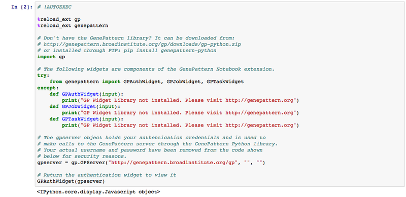
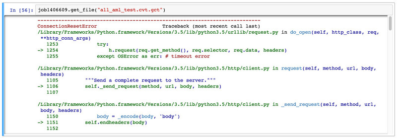

# FAQ
---

## Q: Is g2nb intended for use with Protected Health Information (PHI)?
g2nb is not intended for use with Protected Health Information (PHI). If you want to perform analyses with PHI data, 
please see our [instructions for running a private g2nb instance](https://g2nb.readthedocs.io/en/latest/local-installation/).

## Q: I opened the notebook and I only see code.

A: If you ever load a notebook and see only code instead of your
widgets for the various g2nb tools, this is an indicator that notebook has for
some reason failed to load the appropriate extensions.

This issue can be solved by going through the notebook and executing each cell sequentially.

## Q: I received a "Connection Reset by Peer" Error, what does it mean?

A: If you are attempting to programmatically connect to the g2nb Workspace and
receive a Connection Reset by Peer error, this is likely caused by your
Python environment using an outdated version of SSL/TLS. The g2nb Workspace
only accepts connections using TLS 1.2 or later.

To fix this issue you will need to update the version of OpenSSL used by
your operating system or Python installation. This is particularly an
issue with older versions of macOS. Instructions on how to update the
version of OpenSSL used by macOS can be found here.

## Q: Why is my home directory /home/jovyan?
The g2nb workspace is based off the official Jupyter stacks container. The Jupyter team has decided that `jovyan` is the 
default username in its containers.
