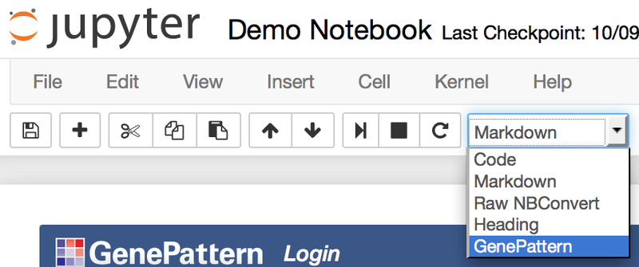

# Jupyter Users
--- 

## 1. g2nb Extension
g2nb is an extension for Jupyter. It provides a variety
of tools for interacting with powerful analysis platforms from
within a Jupyter Notebook environment. These tools include:

-   Visual widgets for running bioinformatic analyses and submitting
    these analyses to a GenePattern server.
-   Tools for visually sending results to downstream steps in a
    bioinformatic workflow.
-   A WYSIWYG rich text editor for Markdown cells.
-   Jupyter magics for creating GenePattern widgets.
-   A Python library for programmatically working with the results of
    the analyses.

To use the g2nb extension, you will need to [register for
an account](https://notebook.genepattern.org/). g2nb usage is free and the software is open source under a BSD-style license.

## 2. What is GenePattern?

GenePattern is a powerful platform for reproducible bioinformatics
research. It provides hundreds of analytical tools for the analysis of
gene expression ([RNA-seq](http://genepattern.org/rna-seq-analysis) and [microarray](http://genepattern.org/gene-expression-analysis)), [sequence variation and copy
number](http://genepattern.org/variant-and-copy-number-analysis), [proteomic](http://genepattern.org/proteomics), [flow cytometry](http://genepattern.org/flow-cytometry), and network analysis.

For more information visit [our main GenePattern page](http://genepattern.org/). For introductory
information about GenePattern, please see our [10-minute tutorial](http://software.broadinstitute.org/cancer/software/genepattern/quick-start) and/or
check out one of our [video tutorials](http://software.broadinstitute.org/cancer/software/genepattern/video-tutorials).

## 3. What is Galaxy?

## 4. What is Cytoscape?

## 5. What is IGV?

## 6. Tool Cells

Tool cells are Python code cells which are automatically
executed, and which display a visual widget for submitting
analyses or working with the results of these analyses. These cells are
displayed as a new cell type, and can be added either through the
Jupyter menu or through the g2nb search functionality.




Tool cells are currently available for four tools: GenePattern, Galaxy, Cytoscape, and IGV

These cells are further broken down into: authentication, analysis and
job cells.

### A. Authentication cells 
are used to authenticate the notebook user with a tool's server. One of these cells must be added to a notebook and the user authenticated before the functionality of other tool cells becomes available. If a tool cell is added to a notebook before authentication has happened, it will automatically become one of these cells.


### B. Analysis cells 
each represent a particular type of analysis on the GenePattern platform. Hundreds of diferent analyses are available. These cells will present a form to the user, accepting data or other parameters. Once one of these forms has been filled out, the user can then run the analysis by clicking the  button. This will submit the analysis to the GenePattern server and display the results.


### C. UI Builder cells
are a way to display any Python function or method call as an interactive widget. This will render the parameters of the function as a web form. The UI Builder will use any existing docstring for the function as a description, will infer parameter types from default values and will display parameter annotations as helpful text near each input.

Since tool cells are also Python code cells, all changes to the
information in these widgets is reflected in the code and will be saved
in the notebook's ipynb file. Similarly, sending one of these notebook
files to a user without the g2nb extension installed,
will result in a complete notebook, albeit one where the cells with
visual widgets are instead displayed as code.

To view the code backing a tool cell, simply click the "Gear"
button found on a g2nb widget in the upper right corner and
select "Toggle Code."

## 7. UI Builder

The UI Builder is a way to display any Python function or method call as
an interactive widget. This will render the parameters of the function
as a web form which can be filled out with numbers, string literals or
with references to existing Python variables. Clicking the  button on
the widget will validate the form and execute the function using the
supplied values.

The UI Builder will use any existing docstring for the function as a
description in the widget, will infer parameter types from default
values and will display parameter annotations as helpful text near each
input.

To use render a function, simply import the GPUIBuilder class from the
genepattern package and pass the function to its constructor.


## 8. GenePattern Python Library

Programmatic access to all jobs and results is also
automatically available using g2nb's Python library. Any job
executed in a notebook can afterward be referenced using

```

job 

```

followed by the job number. For example, if a job is number 1170434, the
variable name would be

```

job1170434 

```

Entering this into a code cell will return a reference to a GPJob
object.

-   For more information on using the g2nb Python library, see
    the [GenePattern Programmer's Guide](http://genepattern.org/programmers-guide#_Using_GenePattern_from_Python).
-   A notebook providing a [tutorial for using the GenePattern Python
    Library](https://github.com/genepattern/example-notebooks/blob/master/GenePattern%20Python%20Tutorial.ipynb) is also available.

Code examples of how to reference GenePattern jobs or GenePattern result
files are available in the notebook by clicking a job result and
selecting "Send to Code" in the menu.


GPJob objects can also be programmatically created and executed without
the need for a GenePattern cell or widget. For information on how to do
this see the [GenePattern Programmer's Guide](http://genepattern.org/programmers-guide#_Using_GenePattern_from_Python) or the [GenePattern Python Tutorial](https://github.com/genepattern/example-notebooks/blob/master/GenePattern%20Python%20Tutorial.ipynb) notebook.
