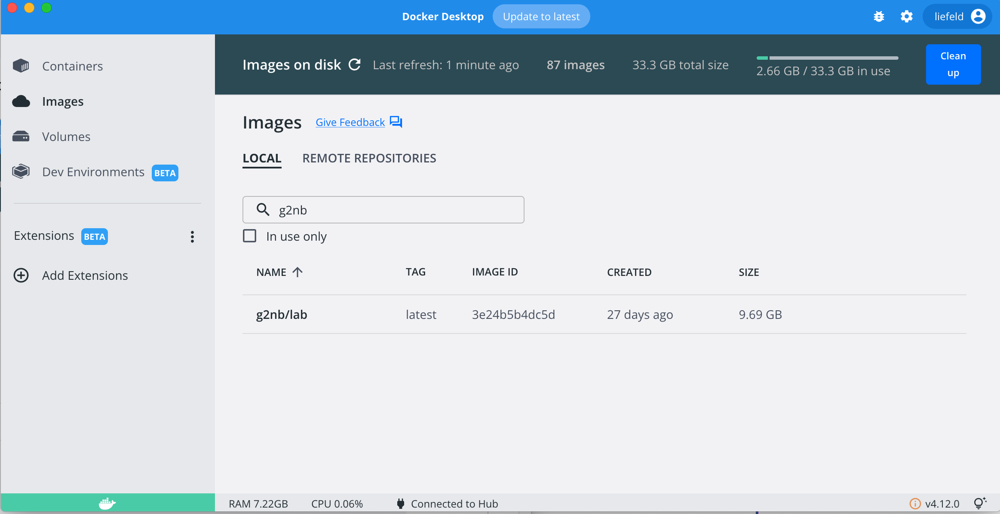
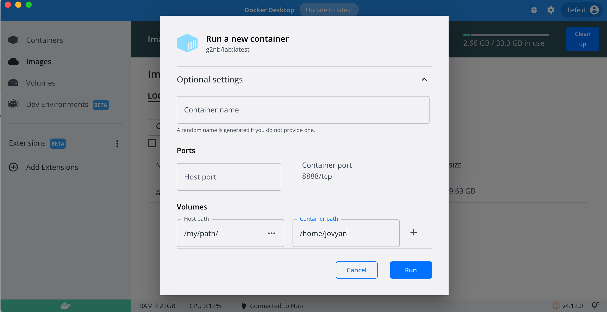
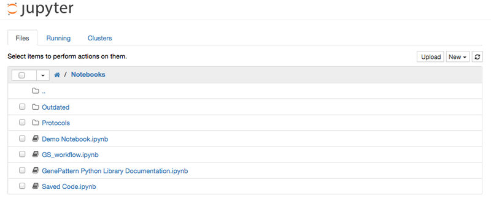
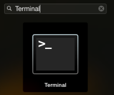

# Local Installation

**Note:** Local installation is for those interested in running the g2nb environment on their local machine. To use the
online workspace, go to the [g2nb Notebook Workspace](https://workspace.g2nb.org).

## Install g2nb Using Docker (Recommended)

Installing g2nb through Docker is the recommended means of installation, as it requires the least manual configuration.

### 1. Install Docker

To install the g2nb environment using Docker, you will first need to download the Docker Desktop application. This application will manage the g2nb environment and automatically perform any necessary configuration.

* [Docker Desktop installation and User Guide](https://docs.docker.com/desktop/)

Once Docker Desktop is installed it will start and launch the Docker Quick Start Guide.  Use this guide to familiarize yourself with Docker Desktop.  

### 2. Download the g2nb Image

With Docker installed and running, in a browser open tab for [g2nb/lab on DockerHub](https://hub.docker.com/r/g2nb/lab/tags) to see the available versions of the g2nb image. In most cases you will want to use the version tagged as *latest*.  You will get this version also if you leave the version blank.

You can install this image into your Docker in a terminal window with the command,  

```

docker pull g2nb/lab

```

This may take a few minutes to download.  Once the download completes you should see the g2nb/lab image appear on the *images* tab of *Docker Desktop*.



### 3.A Run with a Volume (Optional)

By default, any notebooks a user creates will be saved inside the Docker image. A user wanting access to these notebook
files outside of the image is advised to “set a volume.” This allows the user to select a folder on their hard drive.
This folder will be available inside the notebook environment, and all notebooks the user creates will be saved there.

To set a volume, once the installation is completed, an image named “g2nb/lab" will show up in the list on the *Images* tab of the 
Docker Desktop application. Click this item in the list to select it. Afterward, select the *Run button* on the
far right and then select *Optional Settings*. This will present the user with the option to set a local folder to be 
mounted to the container as a volume. Select the desired local folder and for the *Container Path* use ``/home/jovyan``.


### 3.B Run without a volume

If you choose not to set a volumen, any notebooks a user creates will be saved inside the Docker image. 
Once the image download is completed, a container named “g2nb/lab” will show up in the images list on the lefthand side of the
Docker Desktop application. Click this item in the list to select it and then click the 'Run' button on the right hand side.

### 4. Restart a g2nb Container

If g2nb has been run before and stopped (and/or the machine rebooted) there will already be a g2nb/lab container listed in the
*containers* section of the Docker Desktop Application. If this is the case, you can restart, or stop the container using the controls 
on the *Containers* tab.  See the [Docker Desktop Documentation](https://docs.docker.com/desktop/) for more details.


### What’s Next?

* [Using g2nb](https://www.g2nb.org/user-guide/)

## Install g2nb Manually

This method of installing g2nb will set it up natively on your computer. This will require configuring
the computer’s Python environment. It is recommended only for users who are familiar with the command line.

The instructions below will require you to type commands into a terminal window. Mac users can access the terminal
window through the following:


### 1. Install Python and required tools

Before the g2nb extension can be used, the Python programming language must be installed. While Macs come with Python
pre-installed, we recommend the [Anaconda](https://www.anaconda.com/products/distribution) distribution of Python from Continuum
Analytics, as this distribution comes with **`pip`**, Jupyter and other necessary packages, as well as a variety of
other packages useful in scientific computing. You can install the Anaconda package without interfering with other
versions of Python on your system.

To install the Anaconda distribution

- Go to [https://www.anaconda.com/distribution/](https://www.anaconda.com/products/distribution)
- Select your operating system
- Download and run the installer.

To install the required tools individually (not required if you install Anaconda)

If you are using a distribution of Python that does not come with the **`pip`** utility, it must first be installed. To
install **`pip`**:

* Download the installation script ([click here](http://bootstrap.pypa.io/get-pip.py))
* Open a terminal window (see above for instructions)
* Navigate to the directory where you downloaded the installation script
* Tun the installation script by entering the following command into the terminal

```

python get-pip.py

```

!!! note To install **`pip`** you may need administrator permissions, such as running the above command using
the **`sudo`** (Linux, Mac) or **`runas`** (Windows) utilities. If you try the above command and receive a message that
you do not have permissions to execute it, type

```

sudo python get-pip.py

```

and type your password when prompted.

**Install Jupyter and ipywidgets**

Jupyter and its widget library can be installed from the Python Package Index by entering the following command into the
terminal:

```

pip install jupyter ipywidgets

```

!!! note To install a package from PIP you may need administrator permissions, such as running the above command using
the **`sudo`** (Linux, Mac) or **`runas`** (Windows) utilities.

### 2. Install the g2nb meta-package

The g2nb meta-package can be installed from the **`pip`** package manager by entering the following command
into the terminal:

```

pip install g2nb

```

!!! note To install a package using **`pip`** you may need administrator permissions, such as running the above command
using the **`sudo`** (Linux, Mac) or **`runas`** (Windows) utilities. You may also need to restart your terminal window,
if you have only just installed Anaconda.

### 3. Launch Jupyter

To run Jupyter (Mac users):

* Open a terminal window.
* At the prompt, type the following command and then hit Enter:

```

jupyter lab

```

This will start the Jupyter server and open the JupyterLab application in your web browser. This should direct you to a
page that lists all the files in your home directory. You can create folders or open any existing notebook files from
this page.

If your browser did not open, you can alternatively direct your browser to Jupyter by pasting the following URL
into the location bar:

```

http://localhost:8888/

```

Once the Jupyter environment is open in your browser, it should look similar to the screenshot below.



## Updating g2nb

g2nb is updated regularly with new releases. To update your version of g2nb, run the following in the
terminal:

```bash
pip install --upgrade g2nb
```

Mac users can access the terminal window through the following:

* Click the Launchpad icon in your dock: 
* In the Search bar, type Terminal, and then click on the Terminal icon:



## What’s Next?

* [Using g2nb](https://www.g2nb.org/user-guide/)

## Compatibility Notes

* **Python:** g2nb supports Python 3.6+.
* **Jupyter:** The g2nb extension was developed and tested with JupyterLab 3.x.
* **Browser:** g2nb supports Chrome, Firefox and Safari.
